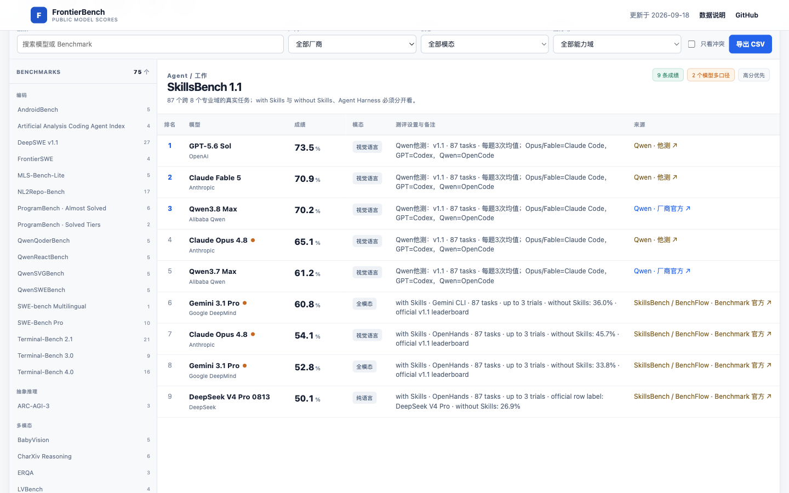

# FrontierBench

[在线榜单](https://syuan03.github.io/frontier-ai-leaderboard/) · [贡献数据](CONTRIBUTING.md) · [MIT License](LICENSE)

FrontierBench 收集领先语言模型、多模态模型和 Agent 模型公开过的 Benchmark 成绩。这里不计算一个笼统的“总分”。不同 Benchmark 的任务、版本和测评环境差别很大，把它们加权成一个数字通常会掩盖问题。

网站默认按 Benchmark 展示排名。每条成绩保留测评设置和原始链接；同一结果被多处发布时合并来源，数值或 Harness 不一致时则并列保存。

[](https://syuan03.github.io/frontier-ai-leaderboard/)

## 当前收录

<!-- DATA_SUMMARY_START -->
- 29 个模型或版本
- 75 个已登记 Benchmark
- 482 条去重公开成绩
- 16 个官方来源
<!-- DATA_SUMMARY_END -->

首版集中在 2026 年仍处于前沿位置的通用、编码、多模态和 Agent 模型，包括 GPT-6 Astra、GPT-5.6 Sol、Claude 5 系列、Gemini 3.8、DeepSeek V4.1、Qwen3.8、GLM-5.3、Seed2.1、Kimi K3 和 Hy4。

Qwen3.8 官方模型卡的 Coding Agent、General Agent 和 General Capabilities 三张表已经逐行录入。Qwen3.8 Max 目前有 51 个不同 Benchmark 的公开结果。开放权重的 `Qwen3.8-2.4T-A95B` 是纯语言模型，Qwen3.8 Max 是支持视觉和官方工具的服务版；两者在模型目录中分开登记。

SkillsBench 1.1、PinchBench v2、WildClawBench 和 WildClawBench-MM 已收录。SkillsBench 保留 Agent Harness，PinchBench 分为 Best Success Rate 和 Average Success Rate，WildClawBench 分为 Overall、Elapsed Time 和 Total Cost。WildClawBench-MM 单独记录多模态 Agent 成绩，包括 Qwen3.8 Omni Flash 官方发布的 71.0 分。

这些数字描述当前仓库，不代表覆盖已经完成。模型厂商发布新表，或者 Benchmark 官方榜更新后，记录会继续补充。

## 使用

这是一个没有构建步骤的静态站点。直接打开 `index.html` 即可，也可以运行本地服务器：

```bash
python3 -m http.server 8000
```

然后访问 `http://localhost:8000`。

改动数据后先运行 `npm run check` 检查 ID、引用关系、空分数和混用单位，再运行 `npm run sync-readme` 更新 README 的收录数量。`npm run audit` 会列出低覆盖模型和只有少量模型参与的 Benchmark，便于安排下一轮补录。

`main` 分支更新后，GitHub Actions 会自动校验数据并部署 Pages。Pull Request 也会检查数据引用和 README 统计是否一致。

页面有五个视图：

- 榜单：按能力域和 Benchmark 查看排名、模态、测评设置和来源。
- 模型对比：选择两到三个模型，查看共同参与或各自参与的 Benchmark。页面不计算跨 Benchmark 总分。
- 覆盖矩阵：横向查看 Benchmark 与模型的覆盖情况。
- 模型：核对版本、别名、上下文、原生模态和开放方式。点击模型后会打开详情，列出全部成绩、设置和来源。
- 来源：查看每个发布页支撑了多少条原始记录。

## 数据结构

所有数据在 `data.js` 中：

- `models` 保存模型归属、版本、别名、模态和开放方式。
- `benchmarks` 保存统一后的名称、版本、能力域和指标方向。
- `sources` 保存原始发布页。优先使用模型厂商、Benchmark 官方榜和技术报告。
- `observations` 保存“模型 × Benchmark × 分数 × 口径”记录。

新增数据时，请先确认模型版本和 Benchmark 版本。相同数值会在页面上合并，来源和设置仍会全部显示。数值不同，或者指标单位不同，就分别建记录并写清 `setting`。新模型没有独立公开分数时可以先登记为 `scoreStatus: "pending"`，不要拿旧版本成绩代替。

模态使用三个值：

- `language`：文本输入，文本输出。
- `vision`：支持文本和视觉输入；是否支持视频或文件在 `modalityDetail` 中说明。
- `omni`：原生支持文本、图像、音频、视频等多种输入。

## 准确性

厂商表里的友商成绩可以入库，页面会把来源标为“他测”。SkillsBench、PinchBench 这类 Benchmark 自己发布的数据会标为“Benchmark 官方”。

同名 Benchmark 如果包含不同指标，会拆成独立榜单。例如 Agents' Last Exam 分为 Pass Rate 和 Overall Score，OSWorld 分为 Binary、Partial 和 Strict，ExploitGym 分为 Success Rate 和 Solved Tasks。复合字符串或不同单位不会参与一个统一排名。

跨来源排名需要结合设置阅读。即使 Benchmark 名称相同，任务集版本、Agent Harness、工具权限、推理强度和采样次数也可能改变结果。这个项目保存公开证据，不声称做过独立复测。

发现错漏时，请按 [CONTRIBUTING.md](CONTRIBUTING.md) 提交修正。

## 项目边界

- 这是公开资料索引，不是独立复测，也不提供采购或模型选型结论。
- 收录优先级是前沿模型、官方成绩表和可核对的 Benchmark 官方榜，不承诺覆盖所有模型。
- 原始来源被修改或撤下时，历史记录可能需要重新核验；欢迎通过 Issue 提交证据。
- 模型名、Benchmark 名和引用内容归各自权利人所有，MIT License 只覆盖本仓库的代码和数据整理结构。

## License

代码使用 MIT License。各 Benchmark 名称、模型名称和引用内容归原权利人所有。
