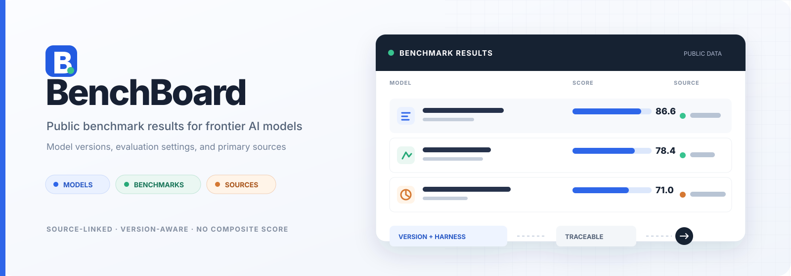

# BenchBoard

[Live leaderboard](https://syuan03.github.io/benchboard/) · [Contribute data](CONTRIBUTING.md) · [MIT License](LICENSE)

BenchBoard collects public benchmark results for current language, multimodal, and agent models. Results stay attached to the model version, evaluation setup, and original source that reported them. BenchBoard does not calculate a cross-benchmark composite score.

[](https://syuan03.github.io/benchboard/)

## Coverage

<!-- DATA_SUMMARY_START -->
- 34 model releases
- 68 benchmark families
- 99 separately ranked metrics and versions
- 613 deduplicated public results
- 23 primary sources
<!-- DATA_SUMMARY_END -->

The first release focuses on general, coding, multimodal, and agent models near the frontier in 2026. It includes GPT-6 Astra, GPT-5.6 Sol, Claude 5, Gemini 3.8, DeepSeek V4.1, Qwen3.8, Qwen3.7 Plus, GLM-5.3, Seed2.1, Kimi K3, and Hy4.

All rows from the Coding Agent, General Agent, and General Capabilities tables in the official Qwen3.8 model card are recorded individually. Qwen3.8 Max currently has public results across 45 benchmark families and 51 separately ranked metric or version views. The open-weight `Qwen3.8-2.4T-A95B` language model and the vision-and-tool-enabled Qwen3.8 Max service are listed separately.

SkillsBench 1.1, PinchBench v2, WildClawBench, WildClawBench-MM, QwenClawBench, ClawEval, Agents' Last Exam, and Workspace-Bench 1.0 are included. Agent harnesses and settings stay attached to each result when the publisher reports them. Benchmarks appear once in navigation; their versions, subsets, and metrics are switchable inside the benchmark view. PinchBench, for example, keeps Best Success Rate and Average Success Rate as separate rankings under one entry. WildClawBench similarly groups Overall, MM, Elapsed Time, and Total Cost without mixing their units or rankings. WildClawBench-MM includes multimodal agent results such as the official 71.0 score reported for Qwen3.8 Omni Flash.

[RNG-Bench](https://internlm.github.io/RNGBench/) appears once with 12 switchable metric views for the comparable rates, scores, efficiency measures, error rates, and Elo in its official main-results tables. The records cover the 10×10 Matching Pairs setting, the 13×13 Maze, and the 16-game-per-model Duel protocol. Raw win, tie, and loss counts remain on the source page.

Coverage is still expanding as model providers and benchmark maintainers publish new tables.

## Use the site

The site has five views:

- Leaderboard ranks models within each benchmark and shows modality, evaluation setup, and sources.
- Compare places two or three models side by side across shared or model-specific benchmarks. It does not combine results into one score.
- Coverage shows the benchmark-by-model matrix.
- Models lists versions, aliases, context windows, native modalities, and access types. Opening a model shows all of its recorded results, settings, and sources.
- Sources shows how many observations each publication supports.

Use the benchmark list on the left to move between leaderboards. Browser search (`Ctrl+F` or `Cmd+F`) works on the visible list.

The **Multimodal Input × Harness** collection requires a named agent harness such as OpenClaw, Claude Code, Codex, OpenCode, or OpenHands and a task that gives the agent an image, audio clip, video, screen, or another non-text file as input. A model's advertised modalities do not determine inclusion. Text-only generation scored by a multimodal judge is excluded. Mixed suites are labeled separately from dedicated multimodal subsets, and the input modalities are shown in the benchmark list. A mixed-suite result is the published score for the full suite, not a score for its multimodal subset. The filtered view has a shareable URL.

## Run locally

BenchBoard is a static site with no build step. Open `index.html`, or serve the directory locally:

```bash
python3 -m http.server 8000
```

Then open `http://localhost:8000`.

After changing `data.js`, run:

```bash
npm run check
npm run sync-readme
npm run audit
```

`check` validates IDs, references, missing scores, and mixed units. `sync-readme` refreshes the coverage counts above. `audit` lists models with sparse coverage and benchmarks with few reported participants.

Pushes to `main` are validated and deployed to GitHub Pages automatically. Pull requests run the same data and README checks.

## Data model

All records live in `data.js`:

- `models` stores provider, release, aliases, modality, and access type.
- `benchmarks` stores normalized names, versions, capability areas, metric direction, and optional collection metadata such as harness and collection scope.
- `benchmarkFamilies` groups related versions, subsets, and metrics under one navigation entry while preserving separate rankings.
- `sources` stores original publication pages. Model-provider releases, official benchmark leaderboards, and technical reports are preferred.
- `observations` stores each model, benchmark, score, and evaluation-setting combination.

Confirm both the model release and benchmark version before adding a result. Identical values can share a displayed row while retaining every source and setting. Different values, metrics, units, or harnesses remain separate observations. A model without a published score may be registered with `scoreStatus: "pending"`; an older model's result must not be used in its place.

Modalities use three values:

- `language`: text input and text output.
- `vision`: text and visual input. Video or file support belongs in `modalityDetail`.
- `omni`: native support for several input types, such as text, images, audio, and video.

## Source policy

A provider's table may contain results for competing models. BenchBoard marks those rows as provider-reported. Data published by benchmark maintainers, including SkillsBench and PinchBench, is marked as benchmark-official.

One benchmark may contain several metrics or settings. Agents' Last Exam, for example, has Pass Rate and Overall Score; OSWorld has Binary, Partial, and Strict; ExploitGym has Success Rate and Solved Tasks. The site shows one benchmark entry with direct metric buttons inside it. Each metric still gets its own ranking and stable URL; composite strings and incompatible units are never forced into one table.

Rankings from different sources still require context. Dataset versions, agent harnesses, tool permissions, reasoning settings, and sample counts can change a result even when the benchmark name matches. BenchBoard indexes published evidence and does not claim independent reproduction.

Found a missing or incorrect result? See [CONTRIBUTING.md](CONTRIBUTING.md).

## Scope and license

BenchBoard is an index of public results, not an independent evaluation or a model-buying recommendation. Coverage favors current models, primary result tables, and official benchmark leaderboards; it is not intended to include every model ever released. Records may need reverification when a source changes or disappears.

The repository's code and data organization are available under the MIT License. Model names, benchmark names, and quoted source material remain the property of their respective owners.
