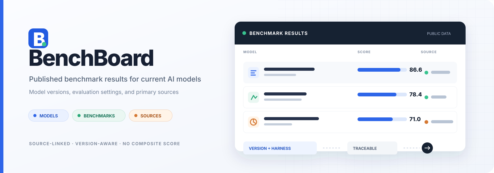

<div align="center">
  <a href="https://syuan03.github.io/benchboard/"></a>

  <p>
    <a href="https://syuan03.github.io/benchboard/"></a>
  </p>

  <p><a href="https://syuan03.github.io/benchboard/">Leaderboard</a> · <a href="docs/audits/model-source-coverage.md">Source coverage</a> · <a href="CONTRIBUTING.md">Contribute</a></p>
</div>

BenchBoard indexes published benchmark results for current AI models. Every score keeps its model release, benchmark variant, evaluation setting, and original source attached. Results from different harnesses or versions remain separate, and the site does not invent a cross-benchmark composite score.

<!-- DATA_SUMMARY_START -->
<p align="center"></p>
<p align="center"><sub>120 curated releases + 23 comparison-only models · 1,188 separately ranked metric and version views</sub></p>
<!-- DATA_SUMMARY_END -->

## Use the data

| Find a result | Compare models | Check the source | Take it with you |
| --- | --- | --- | --- |
| Browse the full benchmark index or use `Ctrl+F` / `Cmd+F`. | Place up to three releases side by side. | Open the release page, model card, paper, or official leaderboard behind a score. | Export the filtered table as CSV or share its URL. |

Opening a model shows every recorded result and setting for that release. The coverage matrix records how completely each source has been checked, and conflicting published values remain visible.

## News

| Date | Update |
| --- | --- |
| 2026-09-28 | Added Claude Opus 5.5, Grok 4.7, GPT-6 Sol, and GPT-6 Luna. Added the full MentalHealthBench views and the complete CursorBench 4.0 table. |
| 2026-09-21 | Completed a broad first-party sweep across release pages, model cards, repositories, and technical reports. Added a generated [source coverage matrix](docs/audits/model-source-coverage.md). |
| 2026-09-20 | Added the [Multimodal Input × Harness collection](https://syuan03.github.io/benchboard/?collection=multimodal-harness) for tasks that give an agent images, audio, video, screens, or other non-text files. |
| 2026-09-18 | Published the first BenchBoard dataset with representative GPT, Claude, Gemini, DeepSeek, Qwen, GLM, Seed, Kimi, and Hy releases. |

## Coverage

The index focuses on recent general, coding, multimodal, and agent models. Older models remain when an official result table uses them as comparisons. Current coverage includes GPT-6, Claude 5.5, Gemini 3.8, DeepSeek V4.1, Qwen3.8, GLM-5.3, Seed2.1, Kimi K3, Hy4, Grok 4.7, and many related releases.

Benchmark families appear once in navigation. Versions, subsets, and metrics are selectable inside that entry. Settings such as reasoning effort, harness, tool access, task count, and snapshot date remain attached to each result.

<details>
<summary><strong>Source and comparison policy</strong></summary>

Model providers, benchmark maintainers, model cards, technical reports, and official repositories are preferred. A provider can report results for competing models; those rows retain the reporting source. Conflicting first-party values stay separate until the settings or data can be reconciled.

A source audit records whether a page was checked in full, checked for selected model columns, used only for metadata, partially imported, inaccessible, or still pending. The generated [model source coverage matrix](docs/audits/model-source-coverage.md) makes that status visible.

BenchBoard is an evidence index. It does not claim independent reproduction or recommend one model from a single score.
</details>

<details>
<summary><strong>Multimodal Input × Harness criteria</strong></summary>

This collection requires both a named agent harness, such as OpenClaw, Claude Code, Codex, OpenCode, or OpenHands, and a task that supplies non-text input. Advertising a model as multimodal is not enough. Text-only generation judged by a vision model is also excluded.

Mixed suites are labeled separately from dedicated multimodal subsets. The input modalities and harness remain visible in the benchmark entry.
</details>

## Contribute

Missing result or incorrect setting? Read [CONTRIBUTING.md](CONTRIBUTING.md), then open an issue or pull request with the original source.

BenchBoard is a static site. To run it locally:

```bash
python3 -m http.server 8000
```

After editing the registry or a data pack:

```bash
npm run check
npm run sync-readme
npm run sync-source-matrix
npm run audit
```

Pushes to `main` are checked and deployed to GitHub Pages. The code and data organization are available under the [MIT License](LICENSE).
